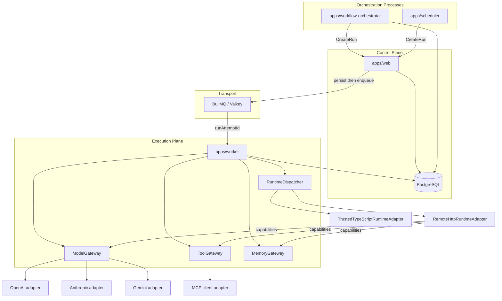

# Architecture Overview

OSVA after Stage 2.9 (Community Beta): a control plane that owns product state and intent, and an execution plane that runs Agent code through runtime adapters. PostgreSQL is lifecycle authority; BullMQ/Valkey transports execution work.

## Planes

**Control plane** (`apps/web`): HTTP API for agents, runs, workflows, schedules, tools, connectors, memory namespaces, evaluations, and AI Office entities. Persists intent, then enqueues execution jobs. Does not execute agent code in request handlers.

**Execution plane** (`apps/worker`): Consumes BullMQ jobs keyed by `RunAttemptId`, drives `ExecuteRunAttempt`, dispatches to runtime adapters, and exposes model/tool/memory capabilities to remote runtimes.

**Supporting processes**: `apps/workflow-orchestrator` reconciles durable workflow state; `apps/scheduler` fires cron schedules into child Runs.

## Core product objects

| Object | Role |
|--------|------|
| Agent / AgentVersion | Immutable versioned agent definition (manifest, runtime, bindings) |
| Run | One logical agent execution; owns frozen effective bindings |
| RunAttempt | Canonical attempt identity; queue redelivery reuses the same id |
| RunStep | Observability record for model/tool/memory steps during execution |
| Workflow / WorkflowVersion | OSVA-owned workflow definition (V1 sequential, V2 DAG) |
| WorkflowRun / WorkflowNodeRun | Durable workflow execution state |
| Tool / ToolVersion | Immutable tool snapshot (internal or MCP) |
| Connector / ConnectorVersion | Immutable MCP transport configuration |
| ModelProfile / ModelProfileVersion | Immutable model provider binding |
| MemoryNamespace / MemoryRecord | Durable JSON key/value memory |
| EvaluationSuite / EvaluationSuiteVersion | Immutable evaluation definition |
| EvaluationRun | Coordinator over ordinary child Runs |
| OfficeWorker / Role / Team / Goal | AI Office organizational metadata (workspace-scoped) |
| Assignment | Organizational work item; freezes AgentVersion/WorkflowVersion and links to Run/WorkflowRun |

## Run lifecycle

1. `CreateRun` persists PENDING Run + PENDING RunAttempt with frozen `EffectiveRunBindings`.
2. Run transitions to QUEUED; BullMQ job payload is `{ runAttemptId }` only.
3. Worker loads persisted state, builds `ExecutionRequest`, executes via `RuntimeDispatcher`.
4. Terminal RunAttempt state drives terminal Run state (SUCCEEDED, FAILED, TIMED_OUT, CANCELLED).
5. RunSteps record model/tool/memory activity with usage and cost where priced.

Queue job IDs (`toBullMqJobId`) are BullMQ implementation details, not OSVA identities.

## Effective Run bindings

At Run creation, OSVA snapshots immutable bindings from the requested AgentVersion:

- `modelProfileVersionBindings`
- `toolVersionBindings`
- `memoryNamespaceBindings`

Execution must use the persisted Run snapshot, not live AgentVersion rows.

## Gateways

| Gateway | Mediates | Stage 2.8 scope |
|---------|----------|-----------------|
| ModelGateway | Provider-neutral text generation | OpenAI, Anthropic, Gemini |
| ToolGateway | Authorization + dispatch | Internal tools + MCP ToolVersions |
| MemoryGateway | Namespace authorization + CRUD | PostgreSQL-backed JSON memory |

Agent runtimes never receive provider credentials, DB handles, or gateway internals directly.

## Runtime implementations

Runtime choice is immutable AgentVersion state (`TRUSTED_TYPESCRIPT`,
`REMOTE_HTTP`, or `CONTAINER`).

- **Trusted TypeScript**: child-process adapter; in-process capability hooks to gateways.
- **Remote HTTP**: synchronous Runtime Protocol V1 POST; `executionId` = `RunAttemptId`; capabilities re-enter OSVA via `RuntimeCapabilityBridge`.
- **Container**: ephemeral OCI container per RunAttempt; RuntimeExecuteRequest via bootstrap HTTP GET; RuntimeExecuteResponse on container stdout (Docker logs); capabilities re-enter OSVA via the same bridge using container-reachable operator configuration.

Runtime Protocol V1 defines schemas and semantics; transport is adapter-specific
(see `docs/implementation/STAGE-3-1-CONTAINER-RUNTIME.md`).

Workflows and approvals are runtime-agnostic.

## MCP integration

MCP is an adapter beneath ToolGateway. Control plane discovers tools into immutable MCP `ToolVersion` snapshots bound on AgentVersion. Execution always flows: runtime → ToolGateway → MCP client → ConnectorVersion → external MCP server.

## Scheduling

Cron schedules (`Schedule` / `ScheduleOccurrence`) are reconciled by `apps/scheduler`. Occurrences create child Runs through the same `CreateRun` → BullMQ path.

## Evaluation architecture

EvaluationRun coordinates one ordinary child Run per EvaluationCase. No separate evaluation worker or engine. After a terminal child Run, `EvaluationCoordinator` reconciles case results. Evaluation Runs default to read-only persistent memory.

## Observability

**Durable product observability** lives in PostgreSQL as Run / RunAttempt / RunStep
records. RunSteps capture step type, timing, normalized usage, token counts, and
estimated cost (where model pricing exists). Unpriced provider usage is recorded
without cost. RunSteps deliberately exclude prompts, tool payloads, and memory
values.

**Exportable diagnostics** (Stage 2.9A) are optional OpenTelemetry traces and
metrics via `@osva/adapters-opentelemetry`. OTLP export is vendor-neutral and
disabled by default. Spans and metrics are auxiliary: export failure or missing
configuration never changes Run lifecycle authority. BullMQ may carry W3C trace
context in transport-only job metadata; trace IDs are not RunAttempt IDs.

## AI Office (Stage 2.9B)

AI Office is an organizational layer above execution. It does not introduce a
new runtime, queue, or permission system.

```text
Goal (optional) → Assignment → OfficeWorker → Agent identity
Assignment → frozen AgentVersion | WorkflowVersion
Assignment launch → CreateRun | WorkflowRun (existing orchestration)
```

`OfficeWorker` references an `Agent` identity but is not executable. `Role` is
organizational metadata, not security RBAC. `Team` is grouping only — Assignments
cannot target Teams. See `docs/platform/AI_OFFICE_LAYER.md`.

## High-level diagram



## Further reading

- `REPOSITORY_MAP.md` — package layout
- `FILE_CATALOG.md` — canonical implementation files
- `DEPENDENCY_RULES.md` — allowed import direction
- `DATA_FLOWS.md` — flow index
- `ARCHITECTURAL_INVARIANTS.md` — numbered invariant list
