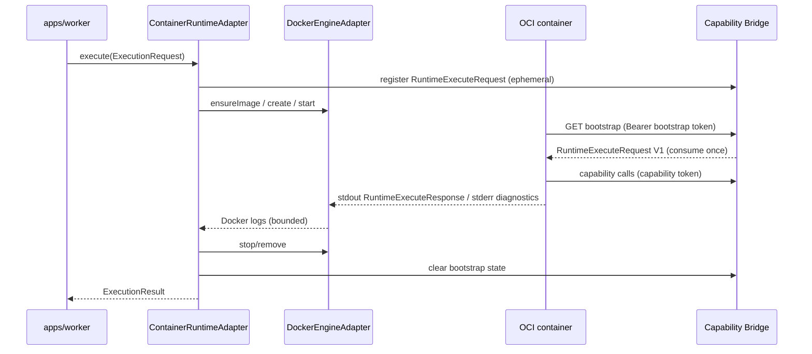

# Container Runtime Execution Flow

## Purpose

Execute a `CONTAINER` AgentVersion in one ephemeral OCI container per RunAttempt
while preserving OSVA lifecycle authority and Runtime Protocol V1 semantics.

## Trigger / entry point

Same as [run-execution.md](./run-execution.md): worker consumes a BullMQ job
containing `{ runAttemptId }` and dispatches through `RuntimeDispatcher`.

## Step-by-step flow

1. **Select executor:** `RuntimeDispatcher` routes `runtime.type === "CONTAINER"`
   to `ContainerRuntimeAdapter` when operator configuration registers it.
2. **Validate descriptor:** digest-pinned canonical image reference and JSON input.
3. **Resolve resources:** operator defaults/maximums via `resolveContainerResources`.
4. **Build RuntimeExecuteRequest V1:** includes execution-scoped capability bridge
   endpoint and HMAC capability token in the payload (not in container env alone).
5. **Register bootstrap:** store the request in ephemeral
   `RuntimeExecutionBootstrapStore`; issue bootstrap token; inject
   `OSVA_EXECUTION_ID`, `OSVA_RUNTIME_BOOTSTRAP_URL`, and
   `OSVA_RUNTIME_BOOTSTRAP_TOKEN`.
6. **Remove stale container:** find OSVA-managed container labeled with the same
   RunAttemptId; stop/kill/remove if present.
7. **Ensure image:** inspect/pull digest-pinned image through Docker Engine.
8. **Create/start container:** isolated Docker create spec with bootstrap env,
   resource limits, operator network mode, and OSVA labels.
9. **Container bootstrap:** agent performs one authenticated GET; bridge returns
   RuntimeExecuteRequest V1 and consumes the registration (single-use).
10. **Execute agent:** agent runs; writes one RuntimeExecuteResponse line to
    stdout; diagnostics on stderr; process exits.
11. **Retrieve logs:** adapter waits for exit (or timeout), fetches bounded Docker
    logs, demuxes stdout/stderr.
12. **Parse response:** stdout must contain exactly one RuntimeExecuteResponse.
13. **Normalize result:** map to `ExecutionResult` success or failure.
14. **Cleanup:** clear bootstrap state; stop/kill/remove container in all paths;
    active executions are terminated on adapter `close()`.

`executionId` equals `RunAttemptId`. One `execute()` is one container execution.
There is no automatic post-start replay inside a single `execute()`.

## Capability access inside the container

```text
container process
  → GET bootstrap → RuntimeExecuteRequest V1
  → HTTP POST {capabilities.endpoint}/v1/runtime/capabilities/...
  → Runtime Capability Bridge
  → scoped ModelGateway / ToolGateway / MemoryGateway
```

Container code never receives binding IDs, database credentials, queue handles,
provider API keys, or the capability signing secret.

## Persisted objects

Unchanged from standard run execution. Container IDs are not persisted in Run or
RunAttempt lifecycle records.

## Redelivery and retries

| Event | Container behavior |
|---|---|
| Queue redelivery | Same RunAttemptId → stale container removed → fresh execution |
| Logical retry | New RunAttemptId → distinct container label |

## Failure / cancellation

- Timeout uses `ExecutionRequest.timeoutMs` only (bootstrap + agent work).
- Protocol violations fail closed with `RUNTIME_PROTOCOL_FAILURE`.
- Transport/engine failures return `RUNTIME_TRANSPORT_FAILURE`.
- Valid agent failures return `AGENT_EXECUTION_FAILED`.

## Diagram



## Key implementation files

- `adapters/runtime-container/src/container-runtime-adapter.ts`
- `adapters/runtime-container/src/docker-engine-adapter.ts`
- `adapters/runtime-container/src/docker-container-config.ts`
- `adapters/runtime-container/src/protocol-io.ts`
- `adapters/runtime-http/src/execution-bootstrap-store.ts`
- `adapters/runtime-http/src/capability-bridge.ts`
- `apps/worker/src/runtime-composition.ts`
- `packages/runtime-core/src/runtime-dispatcher.ts`
