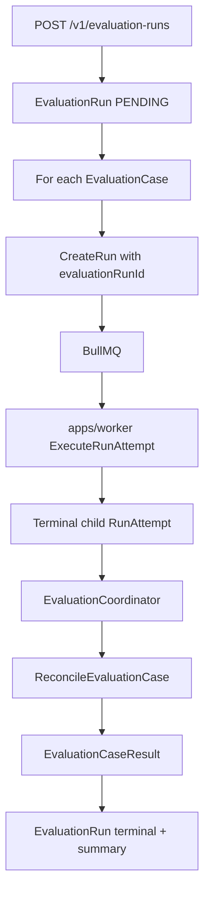

# Evaluation Run Flow

## Purpose

Execute an EvaluationSuiteVersion by coordinating one ordinary child Run per EvaluationCase, then aggregate PASS/FAIL/ERROR outcomes. No separate evaluation worker or execution engine.

## Trigger / entry point

- **API:** `POST /v1/evaluation-runs` with EvaluationSuiteVersionId
- **Worker hook:** `EvaluationCoordinator.reconcileTerminalChildRun` after terminal child RunAttempt

## Step-by-step flow

1. **Create EvaluationRun:** Control plane persists EvaluationRun referencing immutable EvaluationSuiteVersion.
2. **Load cases:** EvaluationSuiteVersion contains immutable EvaluationCase definitions (input, expected output, evaluator config).
3. **Start child Runs:** For each case (or batched per application logic), `EvaluationRunApplication` calls `CreateRun` with:
   - `evaluationRunId` and `evaluationCaseId` on Run
   - Same agent/version as case specifies
4. **Normal execution:** Each child Run follows [run-execution.md](./run-execution.md) through BullMQ and worker.
5. **Memory restriction:** Evaluation child Runs get `evaluationContext`; MemoryGateway blocks persistent mutation by default.
6. **Terminal hook:** Worker handler calls `EvaluationCoordinator.reconcileTerminalChildRun` with runId, runAttemptId, terminal status.
7. **Reconcile case:** `ReconcileEvaluationCase` compares child Run output to case expectation (e.g. JSON exact match evaluator).
8. **Persist result:** Immutable `EvaluationCaseResult` per (evaluationRunId, evaluationCaseId).
9. **Aggregate:** EvaluationRun transitions to terminal when all cases reconciled; summary counts PASS/FAIL/ERROR.

## Persisted objects

| Object | Notes |
|--------|-------|
| EvaluationSuiteVersion | Immutable cases snapshot |
| EvaluationRun | Coordinator state machine |
| Run (child) | Ordinary Run with evaluationRunId/evaluationCaseId |
| RunAttempt | Standard execution path |
| EvaluationCaseResult | Immutable once written |

## Immutability / idempotency

- EvaluationSuiteVersion and cases are immutable.
- EvaluationCaseResult rows are immutable; duplicate reconcile with different content is rejected.
- Child Runs use standard RunAttempt semantics; queue redelivery reuses same attempt id.

## Failure behavior

- Child Run FAILED/TIMED_OUT/CANCELLED → case outcome ERROR or FAIL per evaluator rules (not EvaluationRun infrastructure failure).
- EvaluationRun failure means coordinator could not progress (e.g. CreateRun/enqueue failure), distinct from case FAIL.
- No EvaluationWorker process exists — only `apps/worker` executes agent code.

## What is NOT in this flow

- Separate evaluation queue or worker type
- LLM-as-judge evaluators (Stage 2.8 scope: JSON exact match style)
- Vector memory or semantic evaluators
- Memory mutation during evaluation cases

## Diagram

## Key implementation files

- `packages/domain/src/evaluation-run-application.ts`
- `packages/domain/src/evaluation-suite-application.ts`
- `packages/orchestration/src/evaluation-coordinator.ts`
- `apps/worker/src/execute-run-attempt-handler.ts`
- `apps/web/src/evaluation-http.ts`
- `packages/db/src/repositories/postgres-evaluation-suite-repository.ts`
- `packages/runtime-core/src/create-execution-request.ts` (evaluationContext)
- `packages/memory-gateway/src/memory-gateway.ts` (allowPersistentMutation guard)
