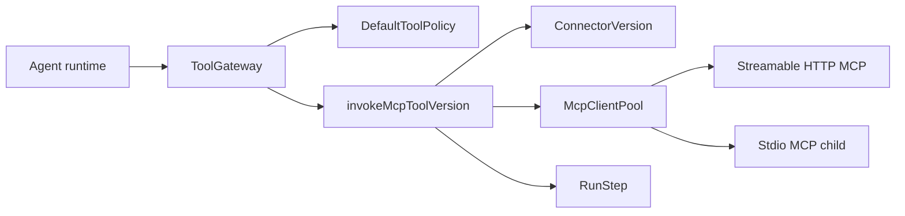
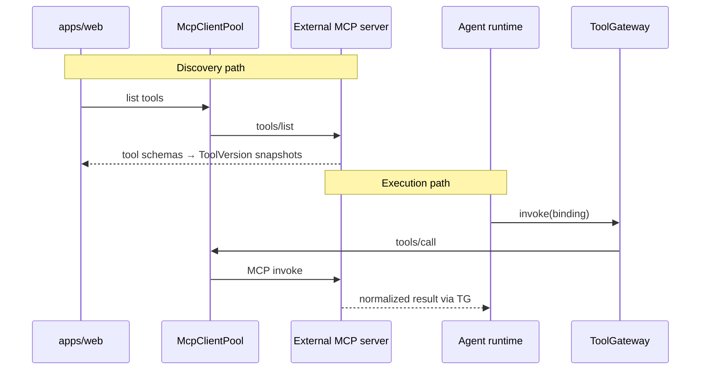

# MCP Tool Call Flow

## Purpose

Execute an MCP-backed tool through ToolGateway using immutable MCP ToolVersion and ConnectorVersion snapshots. MCP never bypasses ToolGateway.

## Trigger / entry point

- **Discovery (control plane):** `POST /v1/connectors/:id/discover` or import endpoints — creates Tool + ToolVersion snapshots
- **Execution (runtime):** Same as [tool-call.md](./tool-call.md) until ToolGateway branches on `version.type === "MCP"`

## Step-by-step flow

### Control plane (discovery)

1. Operator registers **Connector** with immutable **ConnectorVersion** (kind=MCP, transport, transportConfig, auth secret refs).
2. Discovery invokes MCP `tools/list` via `McpClientPool`.
3. OSVA creates **Tool** records and immutable **ToolVersion** snapshots (type=MCP, mcp metadata including connectorVersionId, tool name).
4. AgentVersion binds logical tool names → ToolVersionIds in manifest.

### Execution plane

1. Agent runtime invokes tool by logical binding name (identical to internal tool path).
2. **ToolGateway.invoke** loads ToolVersion; detects `type === "MCP"`.
3. **Policy** runs before MCP dispatch (same authorization path as internal tools).
4. **invokeMcpToolVersion** loads **ConnectorVersion** from ToolVersion.mcp.connectorVersionId.
5. **McpClientPool** acquires client for transport (STREAMABLE_HTTP or STDIO) and resolved secrets.
6. **MCP tools/call** executed against external MCP server.
7. Result normalized to canonical JSON; **RunStep** recorded.
8. Return to agent runtime.

## Persisted objects

| Object | Mutability | Notes |
|--------|------------|-------|
| Connector | Versioned | Logical connector identity |
| ConnectorVersion | Immutable | Transport + auth refs only |
| ToolVersion (MCP) | Immutable | Snapshot including MCP tool schema at discovery time |
| RunStep | Append | TOOL step with MCP metadata |

## Immutability / idempotency

- Remote MCP schema changes require new ToolVersion + AgentVersion rebind; existing Runs keep frozen bindings.
- ConnectorVersion is immutable; new transport/config → new ConnectorVersion.
- Credentials are SecretReferences resolved at adapter boundary, never persisted plaintext.

## Failure behavior

- MCP not configured in worker → TOOL_IMPLEMENTATION_NOT_FOUND.
- Missing ConnectorVersion → TOOL_IMPLEMENTATION_NOT_FOUND.
- MCP adapter errors mapped through ToolGatewayError.
- Discovery failures are control-plane errors; do not affect in-flight Runs.

## Diagram

## Key implementation files

- `packages/tool-gateway/src/tool-gateway.ts`
- `packages/tool-gateway/src/internal/mcp-tool-executor.ts`
- `adapters/mcp-client/src/index.ts`
- `apps/web/src/connector-http.ts`
- `packages/domain/src/connector-application.ts` (via web wiring)
- `apps/worker/src/process.ts` (MCP pool wiring)
