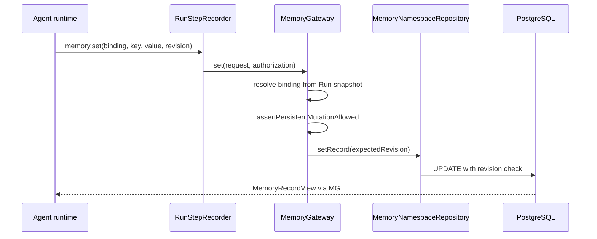

# Memory Access Flow

## Purpose

Agent runtime reads and writes durable JSON key/value memory through MemoryGateway using logical binding names frozen on the Run.

## Trigger / entry point

- **Control plane:** `apps/web/src/memory-http.ts` — namespace CRUD (not runtime path)
- **Runtime:** Memory capability (trusted TS or remote HTTP bridge) → `MemoryGateway`

## Step-by-step flow

1. **AgentVersion binding:** Manifest declares logical memory binding names → namespace id + access (READ_ONLY / READ_WRITE).
2. **CreateRun snapshot:** Bindings copied into `Run.effectiveBindings.memoryNamespaceBindings`.
3. **Runtime request:** Agent uses logical `bindingName` and key (get/set/list/delete).
4. **Authorization:** `MemoryAuthorization` includes workspaceId, run context, and `allowPersistentMutation`.
5. **Resolve binding:** Gateway maps bindingName → namespaceId from Run snapshot; verifies workspace ownership.
6. **Permission check:** READ_WRITE required for set/delete; READ_ONLY bindings reject writes.
7. **Evaluation guard:** If `allowPersistentMutation` is false (evaluation child Runs), set/delete throw MEMORY_PERMISSION_DENIED even for READ_WRITE bindings.
8. **Repository operation:** `MemoryNamespaceRepository` reads/writes PostgreSQL MemoryRecord rows.
9. **Optimistic concurrency:** set/delete accept `expectedRevision`; conflict → MEMORY_CONFLICT.
10. **RunStep:** Recorder persists MEMORY step for runtime operations.
11. **Return:** `MemoryRecordView` with key, value, revision — never exposes raw namespace DB ids to agent code.

## Persisted objects

| Object | Notes |
|--------|-------|
| MemoryNamespace | Workspace-scoped container |
| MemoryRecord | key, JSON value, monotonic revision |
| Run.effectiveBindings | Frozen memoryNamespaceBindings map |

## Immutability / idempotency

- Namespace **contents** may change over time; Run **bindings** are immutable for the Run lifetime.
- Revisions implement optimistic concurrency, not RunAttempt idempotency.
- Logical binding names are stable in agent code; namespace UUIDs are internal.

## Evaluation read-only behavior

Evaluation child Runs carry `evaluationRunId` / `evaluationCaseId` on Run. Execution request includes `evaluationContext`. Memory authorization for these Runs sets `allowPersistentMutation: false`:

- **get/list** allowed per binding access level.
- **set/delete** rejected at gateway regardless of READ_WRITE binding.

Normal Runs retain full binding permissions.

## Failure behavior

- Unknown binding → MEMORY_BINDING_NOT_FOUND.
- Missing key → MEMORY_KEY_NOT_FOUND.
- Revision mismatch → MEMORY_CONFLICT.
- Non-JSON value → MEMORY_INVALID_VALUE.

## Diagram

## Key implementation files

- `packages/memory-gateway/src/memory-gateway.ts`
- `packages/domain/src/memory-application.ts`
- `packages/domain/src/effective-run-bindings.ts`
- `packages/runtime-core/src/create-execution-request.ts`
- `packages/observability/src/run-step-recorder.ts`
- `adapters/runtime-typescript/src/memory-capability.ts`
- `adapters/runtime-http/src/capability-bridge.ts`
- `packages/db/src/schema/memory-records.ts`
