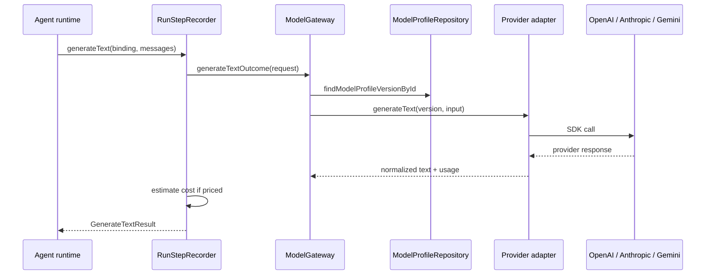

# Model Call Flow

## Purpose

Agent runtime invokes text generation through ModelGateway using immutable ModelProfileVersion bindings frozen on the Run.

## Trigger / entry point

- **Trusted TypeScript:** Agent calls runtime model capability → in-process gateway wrapper
- **Remote HTTP:** Agent POST to capability server → `RuntimeCapabilityBridge` → scoped ModelGateway

## Step-by-step flow

1. **Runtime request:** Agent uses logical binding name from `ExecutionRequest.modelProfileVersionBindings`.
2. **Resolve binding:** Gateway/recorder maps binding name → `ModelProfileVersionId` from Run snapshot (not live AgentVersion).
3. **Authorize context:** Execution-scoped authorization derived from RunAttempt (workspace, run ids).
4. **RunStep start:** `RunStepRecorder` opens MODEL step record.
5. **ModelGateway.generateText:** Loads immutable ModelProfileVersion from repository.
6. **Provider dispatch:** Selects adapter by `provider` field (OPENAI, ANTHROPIC, GEMINI).
7. **Provider adapter:** Calls provider SDK; normalizes text, token usage, finish reason.
8. **Usage / cost:** Recorder extracts usage; `estimateModelCostUsdMicros` when pricing exists.
9. **RunStep persist:** Step saved with normalized payload, usage, cost (or unpriced flag).
10. **Return to runtime:** Normalized `GenerateTextResult` (text) returned to agent code.

## Persisted objects

| Object | Notes |
|--------|-------|
| ModelProfileVersion | Immutable provider/model config |
| RunStep | MODEL type with usage metadata |
| Run / RunAttempt | Unchanged by model call alone |

## Immutability / idempotency

- ModelProfileVersionId comes from Run.effectiveBindings snapshot.
- Each model call creates a distinct RunStep (attempt-level, not idempotency-deduped at gateway).
- Provider credentials never enter domain contracts; resolved in adapter at worker composition root.

## Unpriced semantics

When ModelProfileVersion has no known pricing or provider returns usage without cost mapping:

- Usage tokens may still be recorded on RunStep.
- Cost fields reflect unpriced/absent pricing rather than inventing values.

## Failure behavior

- Unknown ModelProfileVersion → gateway error with MODEL_PROFILE_VERSION_NOT_FOUND.
- Unconfigured provider → MODEL_PROVIDER_UNAVAILABLE.
- Provider SDK errors → normalized MODEL_PROVIDER_ERROR on RunStep and thrown to runtime.
- AbortSignal supported as internal execution option, not part of public GenerateTextRequest contract.

## Diagram

## Key implementation files

- `packages/model-gateway/src/model-gateway.ts`
- `packages/observability/src/run-step-recorder.ts`
- `adapters/model-openai/src/openai-provider-adapter.ts`
- `adapters/model-anthropic/src/anthropic-provider-adapter.ts`
- `adapters/model-gemini/src/gemini-provider-adapter.ts`
- `adapters/runtime-http/src/capability-bridge.ts`
- `packages/domain/src/effective-run-bindings.ts`
- `packages/contracts/src/model-gateway.ts`
