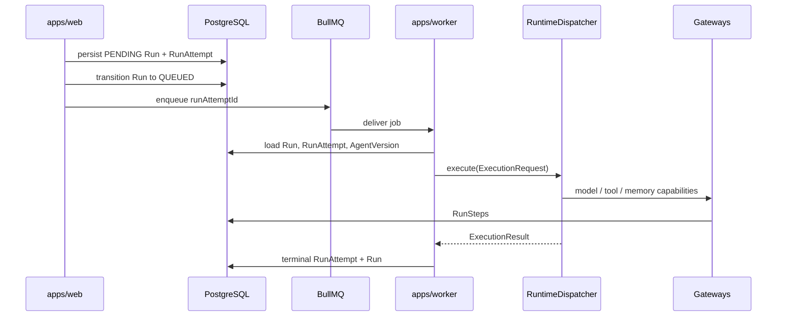

# Run Execution Flow

## Purpose

Create a Run, snapshot immutable bindings, enqueue execution, drive one RunAttempt through a runtime adapter to terminal state, and record RunSteps.

## Trigger / entry point

- **API:** `POST /v1/runs` (`apps/web/src/run-http.ts`)
- **Internal:** `CreateRun.execute` from workflow reconciler, scheduler, or evaluation run starter

## Step-by-step flow

1. **Validate ownership:** `CreateRun` loads AgentVersion via `AgentRepository`; callers cannot override binding snapshot.
2. **Persist PENDING:** Atomically create Run (with `EffectiveRunBindings`) and first RunAttempt (PENDING).
3. **Transition QUEUED:** Run → QUEUED with expected-state semantics; RunAttempt remains PENDING until worker starts.
4. **Enqueue transport:** `JobQueue.enqueue(runAttemptId)` — payload is `{ runAttemptId }` only. BullMQ job ID is encoded separately (`toBullMqJobId`); not an OSVA identity.
5. **Worker consume:** `apps/worker` handler receives payload, calls `ExecuteRunAttempt.execute`.
6. **Load persisted state:** Worker loads Run, RunAttempt, AgentVersion; verifies binding consistency.
7. **Build request:** `createExecutionRequest` produces frozen `ExecutionRequest` from DB snapshots (including `evaluationContext` when present).
8. **Dispatch runtime:** `RuntimeDispatcher` selects adapter from `AgentVersion.manifest.runtime`.
9. **Execute:** Runtime adapter runs agent code; model/tool/memory calls go through gateway-wrapped capabilities.
10. **Persist terminal:** RunAttempt → terminal; Run → matching terminal state. Adapter throws are normalized to FAILED, not left RUNNING.
11. **RunSteps:** Gateway wrappers persist step records with usage/cost where available.
12. **Evaluation hook:** If evaluation child Run, `EvaluationCoordinator.reconcileTerminalChildRun` after terminal attempt.

## Persisted objects

| Object | Authority | Notes |
|--------|-----------|-------|
| Run | PostgreSQL | Owns `effectiveBindings`, input, terminal status |
| RunAttempt | PostgreSQL | Canonical attempt id; queue redelivery reuses same id |
| RunStep | PostgreSQL | Append-only observability |
| BullMQ job | Valkey | Transport only; redelivery ≠ new RunAttempt |

## Immutability / idempotency

- **AgentVersion** and bound ToolVersion/ModelProfileVersion/MemoryNamespace bindings are immutable; Run stores snapshot at creation.
- **Queue redelivery** reuses the same RunAttemptId (and Runtime Protocol `executionId`).
- **New logical retry** creates a new RunAttemptId (separate API/orchestration concern when implemented).
- **CreateRun idempotencyKey** (when supplied) prevents duplicate Run creation at application level.

## Failure / cancellation

- Enqueue failure after QUEUED persist: CreateRun fails; durable QUEUED rows remain recoverable (no transactional outbox in current stage).
- Runtime adapter failure: FAILED RunAttempt with normalized error code/message.
- Already terminal / already in progress: idempotent handler outcomes without duplicate execution side effects.
- BullMQ retry/redelivery: worker re-executes same RunAttemptId; ExecuteRunAttempt handles terminal/no-op paths.

## Diagram

## Key implementation files

- `packages/orchestration/src/create-run.ts`
- `packages/orchestration/src/execute-run-attempt.ts`
- `packages/runtime-core/src/create-execution-request.ts`
- `packages/runtime-core/src/runtime-dispatcher.ts`
- `adapters/bullmq/src/bullmq-job-queue.ts`
- `apps/worker/src/execute-run-attempt-handler.ts`
- `packages/domain/src/effective-run-bindings.ts`
- `packages/domain/src/run-state-machine.ts`
