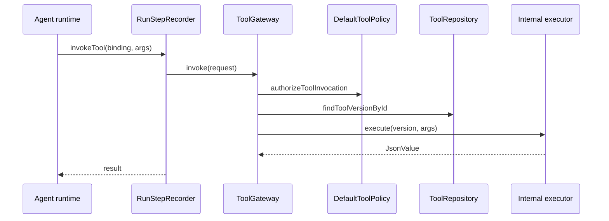

# Tool Call Flow

## Purpose

Agent runtime invokes a bound internal (non-MCP) tool through ToolGateway with server-side permission checks.

## Trigger / entry point

- **Trusted TypeScript:** Runtime tool capability
- **Remote HTTP:** Capability bridge → scoped ToolGateway

For MCP tools, see [mcp-tool-call.md](./mcp-tool-call.md).

## Step-by-step flow

1. **Runtime request:** Agent supplies logical tool binding name and JSON arguments.
2. **Resolve ToolVersionId:** From `ExecutionRequest.toolVersionBindings` snapshot on Run.
3. **Build ToolInvokeRequest:** Includes toolVersionId, arguments, authorization context, optional idempotency key for logical side effects.
4. **Policy check:** `DefaultToolPolicy.authorizeToolInvocation` — permissions are server-side; prompts cannot grant access.
5. **Load ToolVersion:** Immutable snapshot from `ToolRepository`.
6. **Dispatch internal:** `resolveInternalToolImplementation` maps ToolVersion to allowlisted executor.
7. **Execute:** Internal executor runs with canonical JSON arguments.
8. **RunStep:** Recorder persists TOOL step with normalized result or error.
9. **Return:** Canonical JSON value to runtime.

## Persisted objects

| Object | Notes |
|--------|-------|
| ToolVersion | Immutable snapshot bound at Run creation |
| RunStep | TOOL type with invoke metadata |
| External side effects | Defined by tool executor; not OSVA lifecycle |

## Immutability / idempotency

- ToolVersionId from Run.effectiveBindings; not re-read from AgentVersion at invoke time.
- **Tool idempotency key** identifies logical side effects across attempts, not RunAttempt identity.
- ToolGateway does not own deduplication storage in Stage 2.8; idempotency key is passed for executor/policy use.

## Failure behavior

- Unauthorized → TOOL_NOT_AUTHORIZED.
- Unknown ToolVersion → TOOL_VERSION_NOT_FOUND.
- Missing implementation → TOOL_IMPLEMENTATION_NOT_FOUND.
- Executor errors normalized to ToolGatewayError codes; recorded on RunStep.

## Diagram

## Key implementation files

- `packages/tool-gateway/src/tool-gateway.ts`
- `packages/tool-gateway/src/policy/default-tool-policy.ts`
- `packages/tool-gateway/src/internal/registry.ts`
- `packages/observability/src/run-step-recorder.ts`
- `adapters/runtime-http/src/capability-bridge.ts`
- `packages/contracts/src/tool-gateway.ts`
