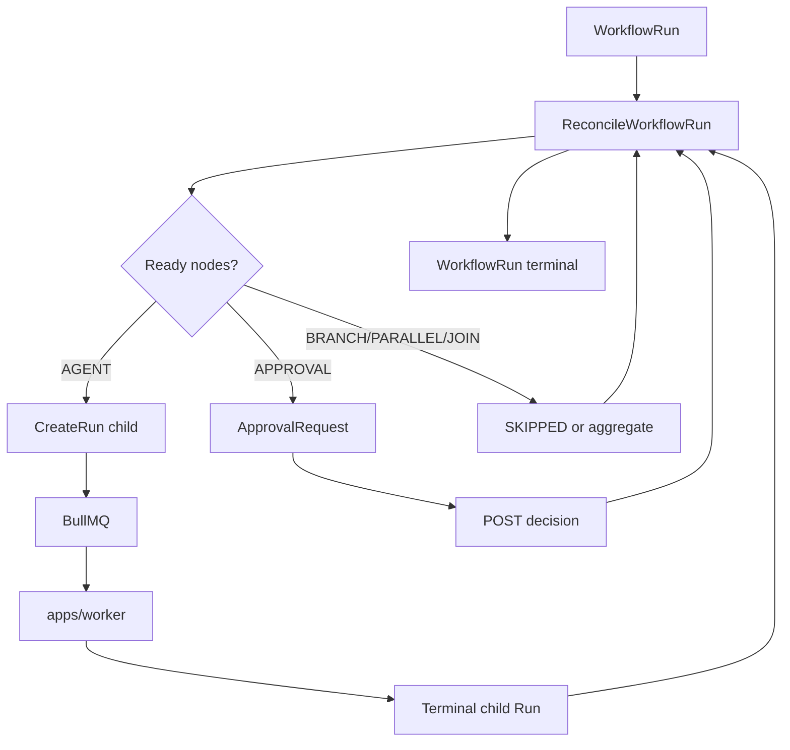

# Workflow Execution Flow

## Purpose

Execute an immutable WorkflowVersion as a durable WorkflowRun: sequential (V1) or DAG (V2) with branch, parallel, join, and approval nodes.

## Trigger / entry point

- **API:** `POST /v1/workflow-runs` creates WorkflowRun in PostgreSQL
- **Reconciliation:** `apps/workflow-orchestrator` polls and calls `ReconcileWorkflowRun`
- **Approval:** `POST /v1/approval-requests/:id/decision` persists decision; reconciler advances

## Step-by-step flow

1. **Create WorkflowRun:** Control plane persists WorkflowRun bound to immutable WorkflowVersion with input.
2. **Orchestrator tick:** `WorkflowOrchestratorTick` loads active WorkflowRuns and invokes reconciler per run.
3. **Build graph:** `buildWorkflowGraph` from WorkflowVersion definition (V1 linear or V2 DAG).
4. **Derive node states:** From persisted WorkflowNodeRun rows — ready, skippable, blocked, terminal.
5. **BRANCH:** Deterministic target selection; inactive paths → durable SKIPPED with propagation.
6. **PARALLEL / JOIN:** Fan-out via ready AGENT nodes; JOIN aggregates succeeded predecessors deterministically by node key order.
7. **AGENT nodes:** When ready, reconciler creates WorkflowNodeRun transition and calls `CreateRun` for canonical child Run (one AGENT node → one child Run).
8. **Child execution:** Child Run follows [run-execution.md](./run-execution.md); BullMQ transports RunAttempt only.
9. **Completion wiring:** Terminal child Run output becomes WorkflowNodeRun output; reconciler runs again.
10. **APPROVAL nodes:** When ready, create ApprovalRequest; WorkflowNodeRun → WAITING_FOR_APPROVAL. No Run created. Human decision via API; reconciler resumes or fails WorkflowRun (APPROVAL_REJECTED).
11. **Workflow terminal:** All required nodes terminal → WorkflowRun SUCCEEDED or first failure → FAILED.

## Persisted objects

| Object | Created by | Notes |
|--------|------------|-------|
| WorkflowVersion | Control plane | Immutable definition |
| WorkflowRun | API | Binds one WorkflowVersion |
| WorkflowNodeRun | Reconciler | Per-node state; AGENT nodes link to child RunId |
| ApprovalRequest | Reconciler | One per APPROVAL node |
| Child Run / RunAttempt | CreateRun | Same path as standalone runs |

## Immutability / idempotency

- WorkflowVersion and referenced AgentVersions are immutable snapshots.
- Reconciliation is idempotent and safe for multiple orchestrator processes.
- WorkflowNodeRun idempotency keys prevent duplicate child Runs on retry.
- BRANCH/JOIN/PARALLEL/APPROVAL never create Runs — only AGENT nodes do.

## Failure / cancellation

- Fail-fast: first FAILED AGENT node fails WorkflowRun; in-flight sibling Runs are not cancelled.
- Sibling success cannot resurrect a FAILED WorkflowRun.
- Rejected approval fails WorkflowRun with APPROVAL_REJECTED.
- WAITING_FOR_APPROVAL on WorkflowRun means human input is the blocker (not BullMQ).

## Multi-agent composition

Different AGENT nodes may bind different immutable AgentVersions on the same WorkflowVersion. Cross-agent handoff happens only through WorkflowNodeRun input/output wiring. No direct agent-to-agent runtime API.

## Diagram

## Key implementation files

- `packages/orchestration/src/reconcile-workflow-run.ts`
- `packages/orchestration/src/workflow-orchestrator-tick.ts`
- `packages/domain/src/workflow-definition.ts`
- `packages/domain/src/workflow-readiness.ts`
- `packages/domain/src/workflow-branch.ts`
- `packages/domain/src/approval-request.ts`
- `apps/workflow-orchestrator/src/loop.ts`
- `apps/web/src/workflow-http.ts`
